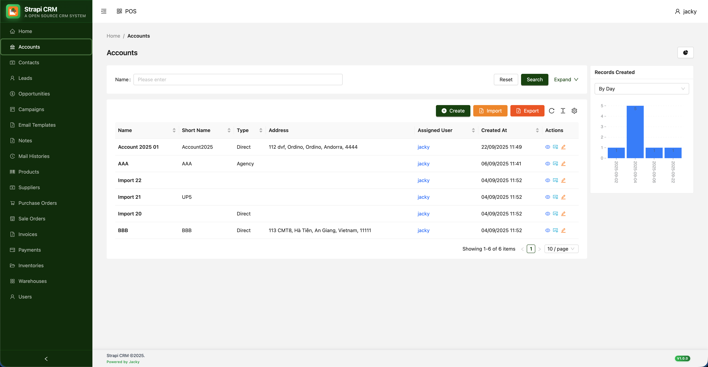
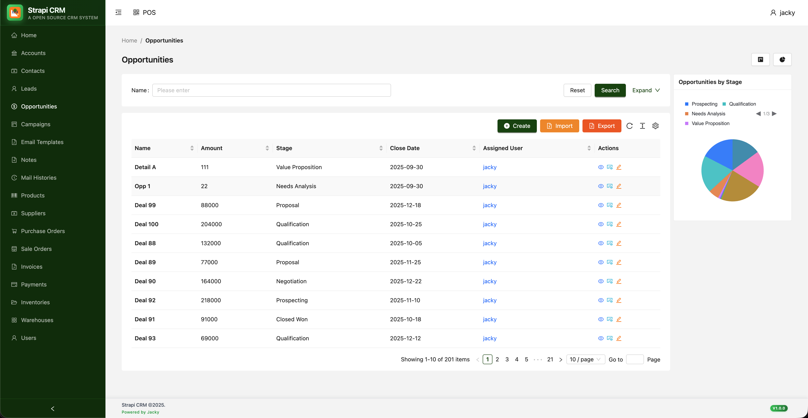
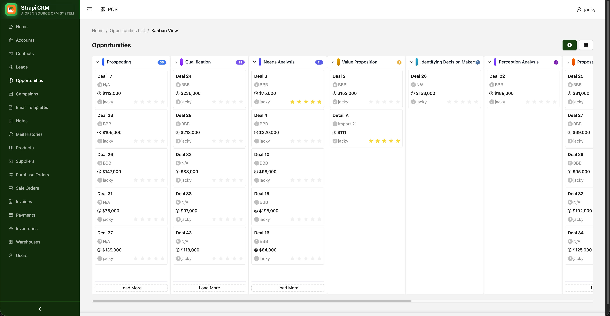

# A Open Source CRM build on Strapi and React

### Systems

- Backend: https://github.com/tdhungit/strapi-crm-api
- Frontend: https://github.com/tdhungit/strapi-crm-fe
- Ecommerce: https://github.com/tdhungit/strapi-crm-ecommerce

### Demo

- Backend: https://strapi-crm-api-production.up.railway.app
- Frontend: https://strapi-crm-fe-five.vercel.app
- Ecommerce: https://strapi-crm-ecommerce.vercel.app

### Screenshots







### Installation Backend

#### npm

```
npm install
npm run dev
```

#### yarn

```
yarn install
yarn dev
```

### Installation Frontend

#### npm

```
npm install
npm run dev
```

#### yarn

```
yarn install
yarn dev
```

### Installation Ecommerce

#### npm

```
npm install
npm run dev
```

#### yarn

```
yarn install
yarn dev
```
